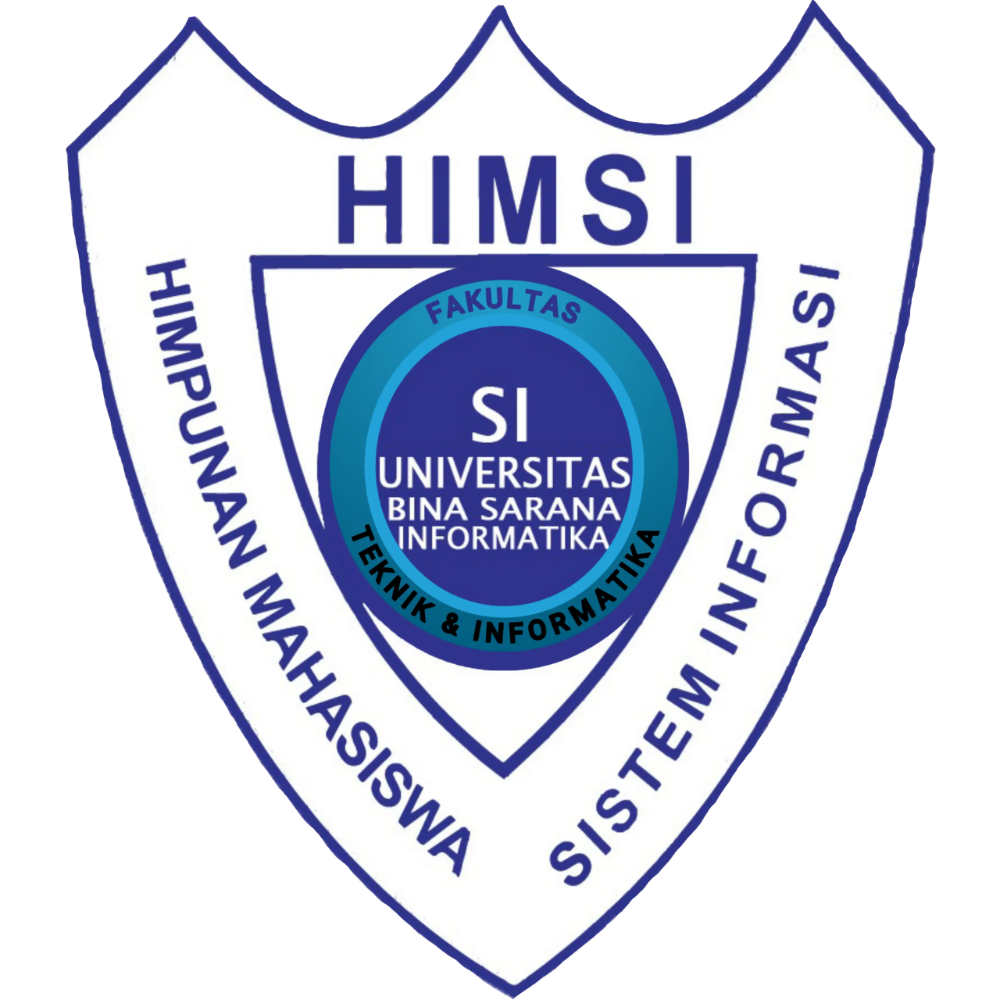

# 🚀 WEBSITE HIMSI CIKARANG
## Universitas Bina Sarana Informatika

[]

)

**ONE ORGANIZATION, ONE FAMILY, ONE GOAL. GOLD!**

> **Web Project** - terdiri dari 5 tim =
1. BPH = Project Manager / Director
2. Kominfo = Frontend Developer
3. Pendidikan = System Analyst
4. RSDM = Database Manager
5. Litbang = Backend Developer

---

## 📋 Tentang Project

Web Project ini adalah program kerja jangka panjang HIMSI UBSI Cikarang yang dirancang memiliki berbagai fitur secara bertahap agar memudahkan pengurus dalam mengelola organisasi dalam proses administrasi, kaderisasi maupun dokumentasi. Dengan adanya projek ini diharapkan dapat meningkatkan keterampilan anggota dalam membangun aplikasi web laravel sekaligus meningkatkan branding HIMSI UBSI CIKARANG.

### 🛠️ Tech Stack
- **Backend:** Laravel / ... 
- **Database:** MySQL / ...
- **Frontend:** Bootstrap 5 / Tailwind / ...

> 💡 **Catatan:** 
> - Direkomendasikan pakai ** + MySQL + Bootstrap 5**
> - Lihat folder `teams/tim-contoh/` untuk referensi kode
> - **TIDAK PERLU HOSTING!** Cukup jalankan di localhost

---

## 📚 Dokumentasi
(Coming Soon)
---

## 🚀 Cara Mulai (untuk Pemula GitHub)
(Coming Soon)
---

## 📞 Person in Charge (PIC)

| PIC | Tim | Kontak |
|-----|-----|--------|

---

## 📅 Timeline

| Tanggal | Kegiatan |
|---------|----------|
| **31 Jan 2026** | Pembagian Tugas Setiap Tim |
| **Coming Soon** | Coming Soon |

---

**🌟 Happy Coding! 🌟**

Dibuat dengan ❤️ oleh HIMSI UBSI Cikarang
Himpunan Mahasiswa Sistem Informasi

2026

